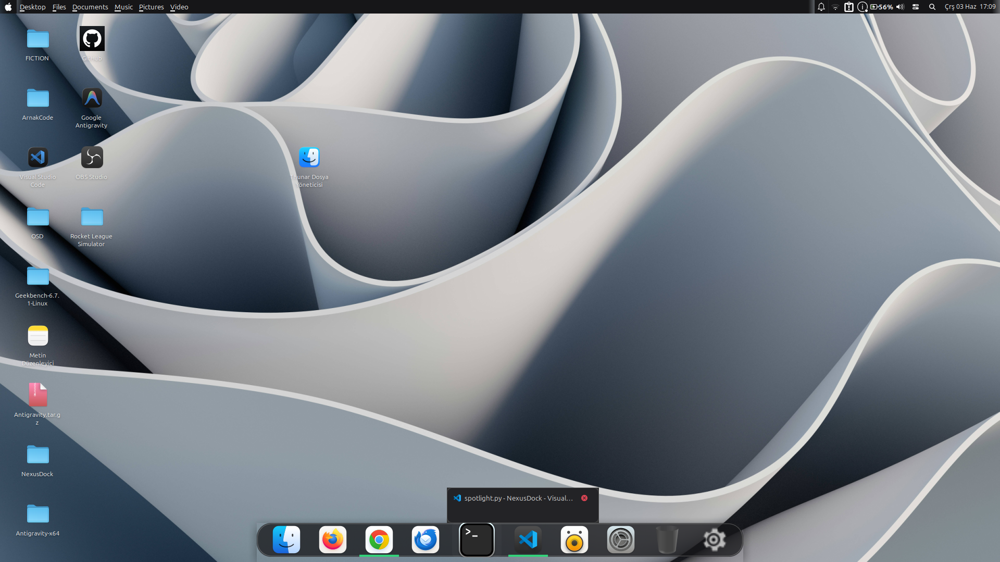
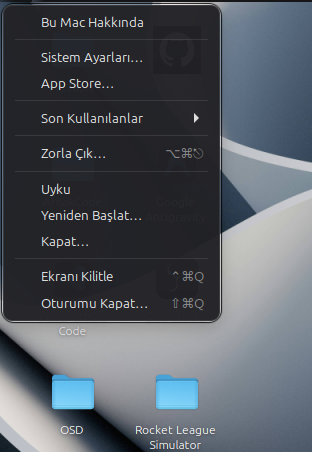
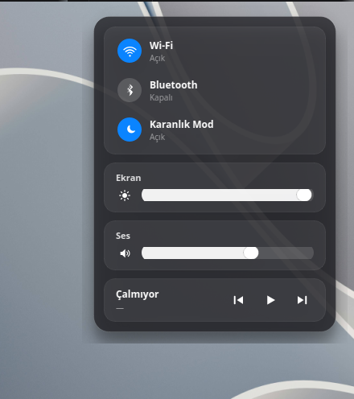
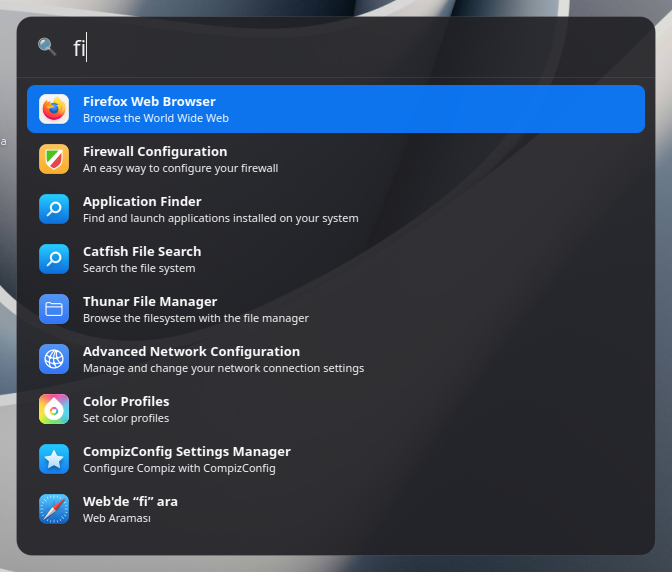
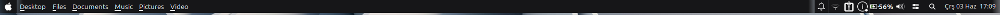
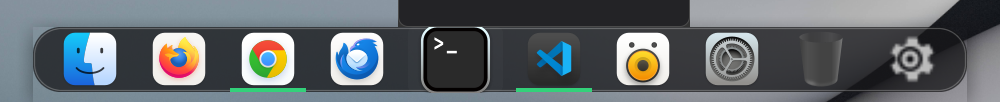
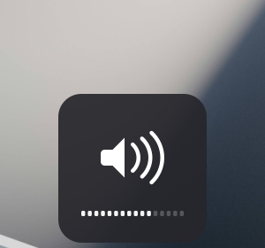

<div align="center">

# 🍎 Cupertino

### Turn your Linux **XFCE** desktop into **macOS** — with one command.
### XFCE masaüstünü tek komutla **macOS**'a çevir.


*A free & open-source alternative to MyDockFinder — built for XFCE, runs smoothly even on weak GPUs.*



</div>

---

## ✨ Features / Özellikler

- 🍎 **Apple menu** — click the Apple logo for a real macOS menu: **About This Mac**, System Settings, Sleep, Restart, Shut Down, Log Out — with macOS-style confirm dialogs
- 🔍 **Spotlight** — `⌘`(Win)`+Space` search: apps, calculator, web — instant (RAM-resident)
- 🚀 **macOS dock** — rounded, translucent, hover magnification, window previews, running indicators — **without picom** (uses XFCE's own compositor → smooth on weak Intel GPUs)
- 🔊🔆 **macOS OSD** — volume & brightness keys show a Big-Sur-style overlay
- 🔔 **macOS notifications** — rounded, translucent, light & dark
- 🎚️ **Control Center** — Wi-Fi / Bluetooth / Dark Mode toggles + brightness/volume sliders + Now Playing
- ⚙️ **Settings GUI** — tune transparency, dock size/gap, corners, previews… live
- 🌗 **Light & Dark themes** · 🌍 **8 languages** (EN, TR, ES, DE, FR, RU, PT, ZH — auto-detected)
- 🧊 *Optional* frosted-glass blur (picom) for capable GPUs

## 📸 Screenshots

| Apple menu | Control Center | Spotlight |
|:--:|:--:|:--:|
|  |  |  |

**Menu bar** — Apple menu + global app menu + status icons & clock


**Dock** — rounded, translucent, no picom


**OSD** — volume / brightness overlay
<br>

## 📦 Requirements / Gereksinimler
- **XFCE** desktop (Linux Mint XFCE, Xubuntu, or Ubuntu + XFCE session)
- Internet connection (the installer fetches packages & builds the dock plugin)

> ⚠️ Won't work on GNOME (stock Ubuntu). XFCE only.

## 🚀 Install / Kurulum

### Option A — Easiest (no git) / En kolay
```bash
curl -L https://github.com/ahmeteminarn2013-cell/Cupertino/archive/refs/heads/main.tar.gz | tar xz && cd Cupertino-main && ./install.sh
```
Or: green **Code** button → **Download ZIP** → extract → run `./install.sh` in the folder.

### Option B — With git / git ile
```bash
git clone https://github.com/ahmeteminarn2013-cell/Cupertino.git
cd Cupertino && ./install.sh
```

Then **log out and back in** so the global menu activates. That's it! 🎉

The installer (idempotent) sets up: packages → WhiteSur icons → docklike dock (compiled, with magnification patch) → menu bar → no-picom rounded dock → Apple menu → Spotlight → OSD → notifications → Control Center → Settings GUI → daemons.

## 🎛️ Usage / Kullanım
- **Apple menu:** click the 🍎 logo (top-left)
- **Spotlight:** `⌘`(Win)`+Space` — or the 🔍 button in the top bar
- **Control Center:** the toggle icon in the top bar
- **OSD:** press your volume / brightness keys
- **Settings:** ⚙️ icon in the dock (*Cupertino Settings*)
- **Dock gap:** `./set-gap.sh 12` (px)

## 🧠 How it works / Nasıl çalışıyor
100% userspace — no kernel or system files touched. Everything lives in `~/.config` and this folder:
- XFCE panels (menu bar + dock) via `xfconf`; **dark/light use XFCE's own compositor + generated PNG backgrounds** (rounded + translucent **without picom** — the key trick for weak GPUs). picom stays optional for blur.
- GTK CSS (`gtk-panel.css`) for menus & notifications
- `xfce4-docklike-plugin` 0.4.2 compiled with `docklike-cupertino.patch` (magnification)
- PySide6 / GTK daemons (RAM-resident, instant): Control Center, Apple menu, Spotlight, OSD, dock-bg watcher

## ⚠️ Known limitations / Bilinen sınırlar
- Tested on **Linux Mint XFCE 21/22**. Other XFCE versions/distros may need tweaks (fully dynamic panel discovery is on the v2.1 roadmap).
- **Drag-to-open** onto a dock icon isn't supported (xfce4-panel intercepts drops). Drag onto the app **window** instead.

## 🙏 Credits / Krediler
Built on [xfce4-docklike-plugin](https://gitlab.xfce.org/panel-plugins/xfce4-docklike-plugin),
[WhiteSur-icon-theme](https://github.com/vinceliuice/WhiteSur-icon-theme),
[picom](https://github.com/yshui/picom) and more — see [CREDITS.md](CREDITS.md).

## 📄 License / Lisans
**GPL-3.0** — see [LICENSE](LICENSE).

---
<div align="center">
Made with 🍎 for the Linux community · İyi kodlamalar!
</div>
